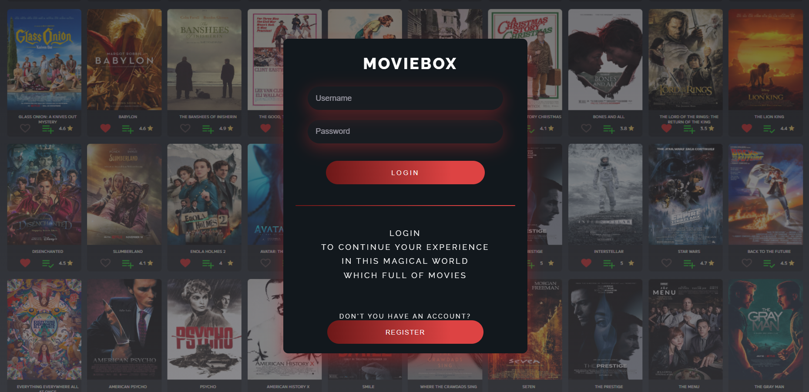
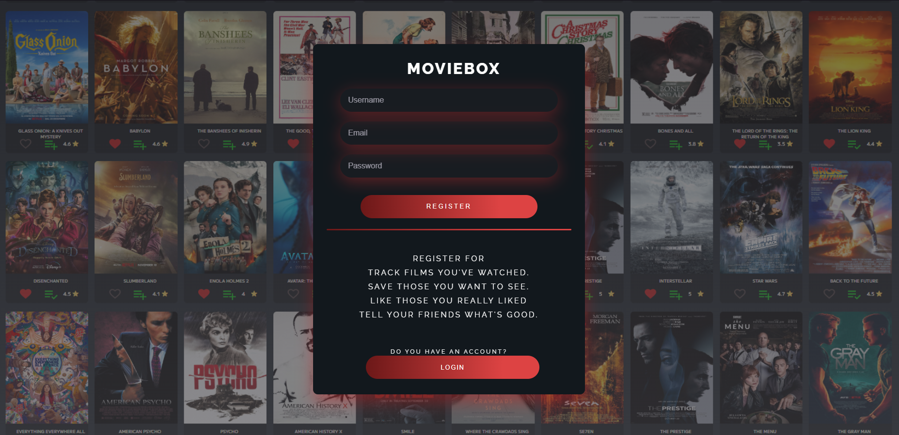
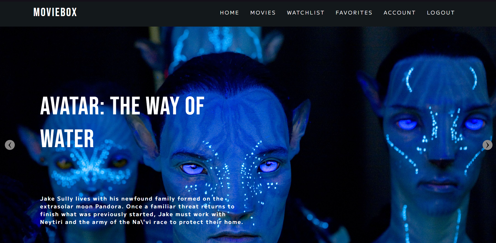
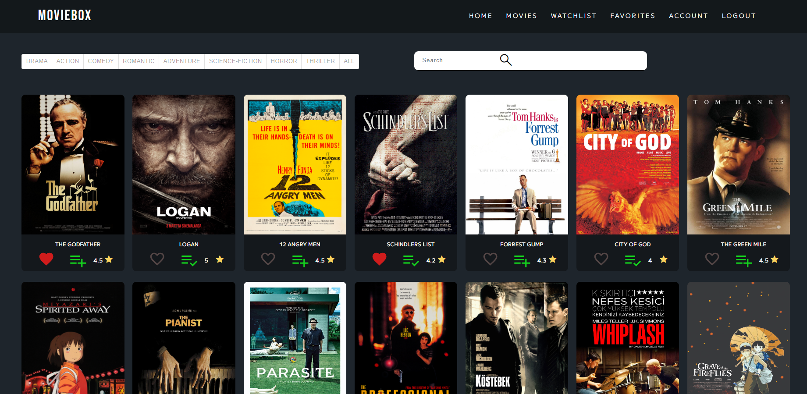
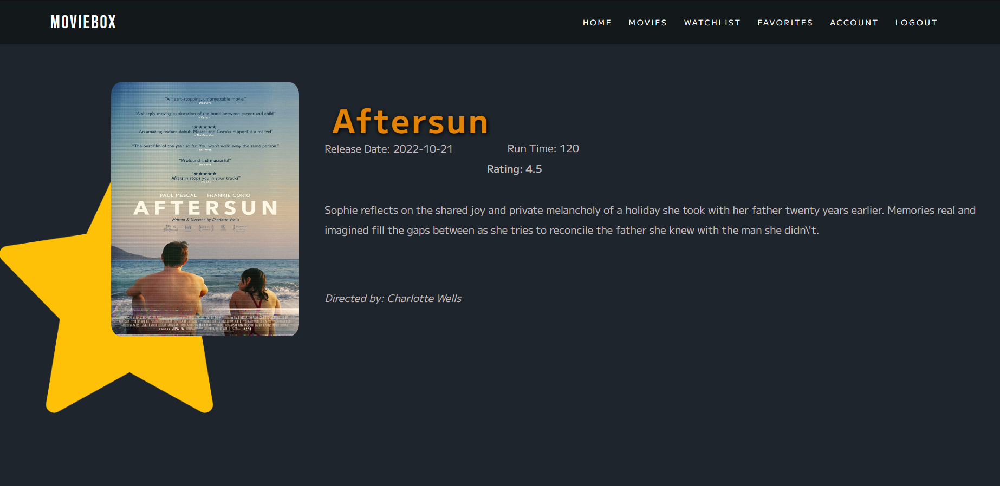
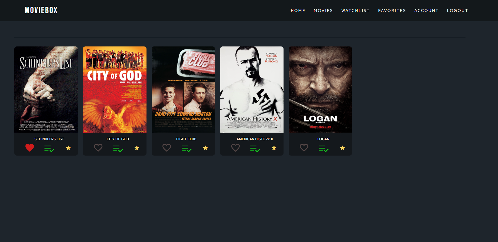
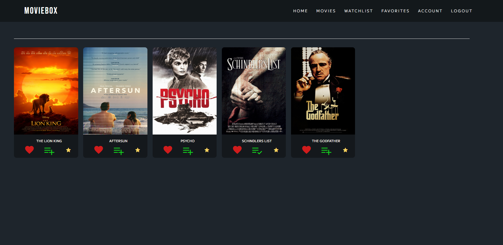

# FULLSTACK MOVIEBOX WEBSITE - CLONE PROJECT

## Purpose of the Project

**This project was developed as a clone for educational purposes and is not connected to any official or external URL.**

The purpose of the system is to create a social network for the user to have general information about movies.The system allows the user to browse the movies, have information about the movies, and add the movies they want to watch later to their watchlist.User can create a favorites list from movies.The user can search for movies by category, or they can directly search for any movie they want.In order for the system to benefit from these features, the user must sign in. If he does not have an account, the user can create an account. 

## Operation List

* Login/Register
* Home page (information about website)
* Movies page (categorize movies or search for a movie)
* Description (detailed information about the movie that clicked on)
* Add/Remove movies to Watchlist and display all in Watchlist page
* Add/Remove movies to Favouritesand display all in Favourites page
* Account page (Display/Update profile)
* Logout

## Used Technology, Tools and Programming Languages

* Visual Studio Code for IDE
* ReactJS for FrontEnd
* NodeJS for BackEnd with Express Framework and bcrypt,jsonwebtoken libraries for protected Authentication
* MySQL Database for keep the all information about Users and Movies.

## ScreenShots

* Login Page

* Register Page

* Home Page

* Movies Page

* Movie Description Page

* Watchlist Page

* Favourites Page

